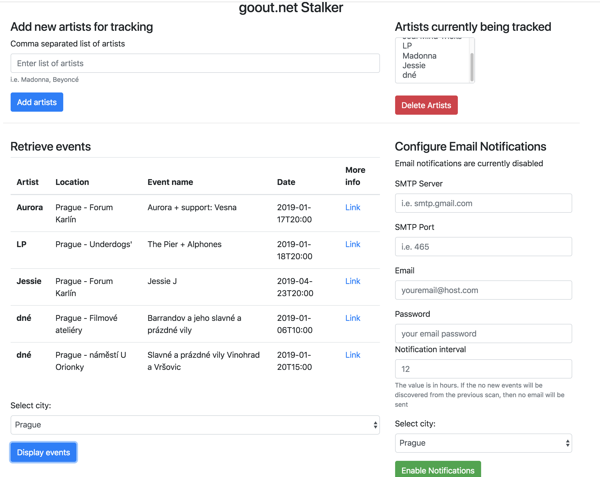

GoOut-Stalker is microservice application which watches out for new events of your favourite artists in the selected city. If new events are found, the application will send you the email. The application checks for new events every 12 hours and the email is send only if the results are different from the previous scan. Currently only events published on goout.net website are being taken into the consideration.


### Prerequisitse
Since the docker image of this application is not (yet) published in the Docker Hub you will need to build it yourself. For this, the prerequisities are:
 - docker (engine 18.09.0+)
 - docker-compose (3.7+)
 - mvn (3+)
 - jdk (8+)


### Sample usage
The application is by default pre-defined with following artists inside goout-stalker.env
INIT_ARTIST_LIST=dné,Jedi Mind Tricks,Aurora,Jessie

You can either modify this file before building the app or you can simply configure your favourite artists during runtime, either via UI or REST interface.


 - Build the application and run it
```bash
$ ./build.sh && docker-compose up
```

If the MongoDB container will not boot up within 90s then the application will timeout. In case you need to increase this value (i.e. it's taking too much time for MongoDB to start up at your end) you can do it by altering variable WAIT_HOSTS_TIMEOUT inside docker-compose.yml file.

The application will be accessible in your browser under `localhost`
It uses ports 80, 8080, 27017.

The UI is build on top of jQuery+Bootstrap v4 (I know, so 2010..) and it's a single web page looking like this:



You can either retrieve the events manually (or via rest api) or simply enable email notification. 

 - Email integration is tested against gmail smtp server and in order to make this work you need to enable "Less secure apps" option in your gmail settings. More info [here](https://www.google.com/settings/security/lesssecureapps)
 - The email address provided will be the one used in authentication against the smtp server, as well as the one sending and receiving an email (this is by design)

Example email:

```json
Hi,
 here are some new events for you. 

{
    "Aurora":[
        {
            "city":"Prague",
            "name":"Aurora + support: Vesna",
            "date":"2019-01-17T20:00",
            "url":"http://goout.net/en/concerts/aurora+support-vesna/xjgcd/+jojmj/",
            "venue":"Forum Karlín"
        }
    ],
    "Jessie":[
        {
            "city":"Prague",
            "name":"Jessie J",
            "date":"2019-04-23T20:00",
            "url":"http://goout.net/en/concerts/jessie-j/ygsud/+hovgl/",
            "venue":"Forum Karlín"
        }
    ],
    "dné":[
        {
            "city":"Prague",
            "name":"Barrandov a jeho slavné a prázdné vily",
            "date":"2019-01-06T10:00",
            "url":"http://goout.net/en/other-events/barrandov-a-jeho-slavne-a-prazdne-vily/ejwhd/+lmibl/",
            "venue":"Filmové ateliéry"
        },
        {
            "city":"Prague",
            "name":"Slavné a prázdné vily Vinohrad a Vršovic",
            "date":"2019-01-20T15:00",
            "url":"http://goout.net/en/other-events/slavne-a-prazdne-vily-vinohrad-a-vrsovic/civud/+hadhl/",
            "venue":"náměstí U Orionky"
        }
    ]
}
```
### Application properties

There are other properties which can influence the the application besides those present in the goout-stalker.env. Here is their exhaustive list:

Property name | Property explanation | Default Value
------------ | ------------- | -----------------
| NOTIFICATIONS_ENABLED | When set to true, emails notifications will be enabled. This requires additional mail related properties to be configured properly | false |
| SMTP_SERVER | Required when NOTIFICATIONS_ENABLED=true, i.e. smtp.gmail.com | N/A |
| SMTP_PORT | Requires when NOTIFICATIONS_ENABLED=true , i.e. 465 | N/A |
| MAIL_USERNAME | Required when NOTIFICATIONS_ENABLED=true, i.e. yourEmail@gmail.com | N/A |
| MAIL_PASSWORD | Required when NOTIFICATIONS_ENABLED=true, password for "yourEmail@gmail.com" | N/A |
| DB_PORT | Port for MongoDB, required | 27017 |
| MONGODB_DATABASE | Name of the MongoDB| goout-stalker |
| MONGODB_USER | User for MongoDB | goout-admin |
| MONGODB_PASSWORD | Password for MongoDB user | password1! | 
| DB_HOST | Mongo DB host | mongodb. Set automagically by docker networking |
| GO_OUT_CITY | City you want to scan, possible values are: Prague, Brno, Ostrava, Pilsen, Berlin, Warsaw, Cracow, Wroclaw | N/A |
TIMER_INTERVAL | Scanning interval in hours | 12 |
|TESTING | When testing is set to true, the scanning interval shrinks from hours to seconds | false |

### REST Specification
The app is ready to be consumed by frontend app via REST API.
Its specification can be found at:
- http://localhost:8080/api/swagger.json

swagger-ui
- http://localhost:8080/index.html


### OpenShift support
To ease deployment on OpenShift, a template file is provided. The MongoDB requires PV. Here are instructions:
```bash
$ oc new-project goout-stalker
$ oc import-image java:8 --from=registry.access.redhat.com/$ redhat-openjdk-18/openjdk18-openshift --confirm
$ oc create -f openshift/goout-stalker-template.yml -n openshift
$ oc new-app --template=goout-stalker-template -p DATABASE_NAME=goout-minishift -p DATABASE_PASSWORD=password1! -p DATABASE_USER=goout-stalker -p BACKEND_HOSTNAME=goout-backend.192.168.64.6.nip.io -p CLIENT_HOSTNAME=goout-client.192.168.64.6.nip.io
```
All of the above parameters are required. You will have to change the hostname so it corresponds to your default subdomain. If you are using minishift, here is a trick how to find it out:
```
$ minishift openshift config view | grep routing -A 1
```
